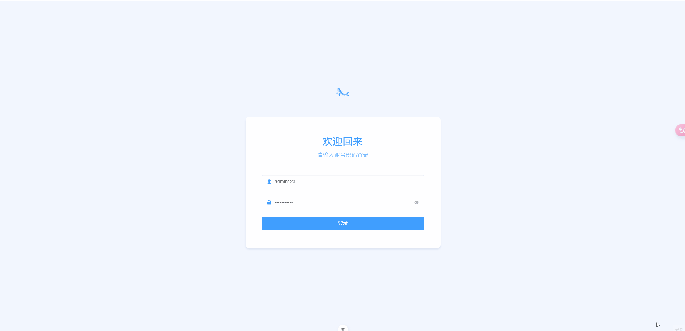

# element-admin-template

基于element-plus、vue3、pinia的后台管理模版

## 起因

忙着写后端代码，发现需要一个管理后台来可视化操作一些数据，但是看了下市面上现成的模板都很复杂，都内置了很多复杂的逻辑，虽然说变得很强大了，但是也不利于二开，需要花太多的心智在了解这个后台上了，但是我就是为了省事才不想自己封装的，为此就想自己弄一个简单的模板，保留基本的功能，复杂的逻辑都可以后续添加。

于是找了一个ui还不错的开源模板，然后自己研究并手搓了这个后台。

感谢 [Element-Admin](https://github.com/KYX1234/Element-Admin) 这个项目。

## 效果图



## 特性说明

1. 封装了remix icon图标字体；
2. 策略模式路由守卫；
3. 基于路由生成侧边栏；
4. 简单的axios封装；
5. 只使用了scss预处理（没有使用unocss），新手上手也是嘎嘎快；
6. 其他想起来补充...

## 特殊说明

### icon图标字体

由于element-plus的图标字体太少了，我找了好久发现remix icon的图标字体还不错，利用`xlink`的方式实现，当然为了也能使用element的icon图标，封装了`Icon`组件，传入对应的图标name即可。

比如你想用element的图标，就以`el-icon-`开头，比如我们在官网点击图标一般得到如下内容：

```html
<el-icon><Connection /></el-icon>
```

那么name就是：`el-icon-connection`；

如果使用remix的图标，我们打开官网：[remix](https://remixicon.com/)

直接复制class名称即可，比如点击图标会显示代码：

```html
<i class="ri-arrow-up-line"></i>
```

那么name就是：`ri-arrow-up-line`；

> 实现原理分两块：
> 1.element的图标是将所有图标组件挂载为全局了；
> 2.remix是利用xlink引入一个完整的图标svg文件，然后通过#name的方式显示对应的icon；
> 本质上都是引入了大量内容，主要是为了省事，如果你对打包后的体积有要求，可以考虑自己单个import引入，比如svg可以单个下载完后，用`vite-plugin-svg-icons`这个插件来调用。具体可以自己研究了。

### icon的hooks

element的组件常常会有一些地方可以直接将vue组件作为props的形式传入，比如表单的图标：

```html
<template>
  <el-input v-model="input3" :suffix-icon="Search" />
</template>

<script lang="ts" setup>
import { Search } from '@element-plus/icons-vue';
</script>
```

这种方式如果我们想使用remix的图标，直接使用Icon组件是不行的，因为Icon组件需要传入一个name参数，才可以正常使用，这种场景显然不合适。

简单的做法就是基于Icon组件封装一个新的vue组件，这样做显然非常麻烦，为此封装了一个`useIcon`的hooks，可以直接传入remix的icon name，然后返回一个渲染好的Icon组件。

```html
<template>
  <el-input v-model="input3" :suffix-icon="Search" />
</template>

<script lang="ts" setup>
import { useIcon } from '@/hooks/useIcon';

const Search = useIcon({name: "ri-search-line"});
</script>
```

这样就能直接使用remix的图标了，当然你传`el-icon-xxx`也是可以的，只不过会显示element的图标。

### 环境变量

1. `VITE_APP_TITLE`用于控制页面的标题和部分需要使用标题的地方，比如侧边栏logo旁的文字。
2. `VITE_APP_BASE_URL`用于控制路由的前缀链接，不懂就看vue-router文档。
